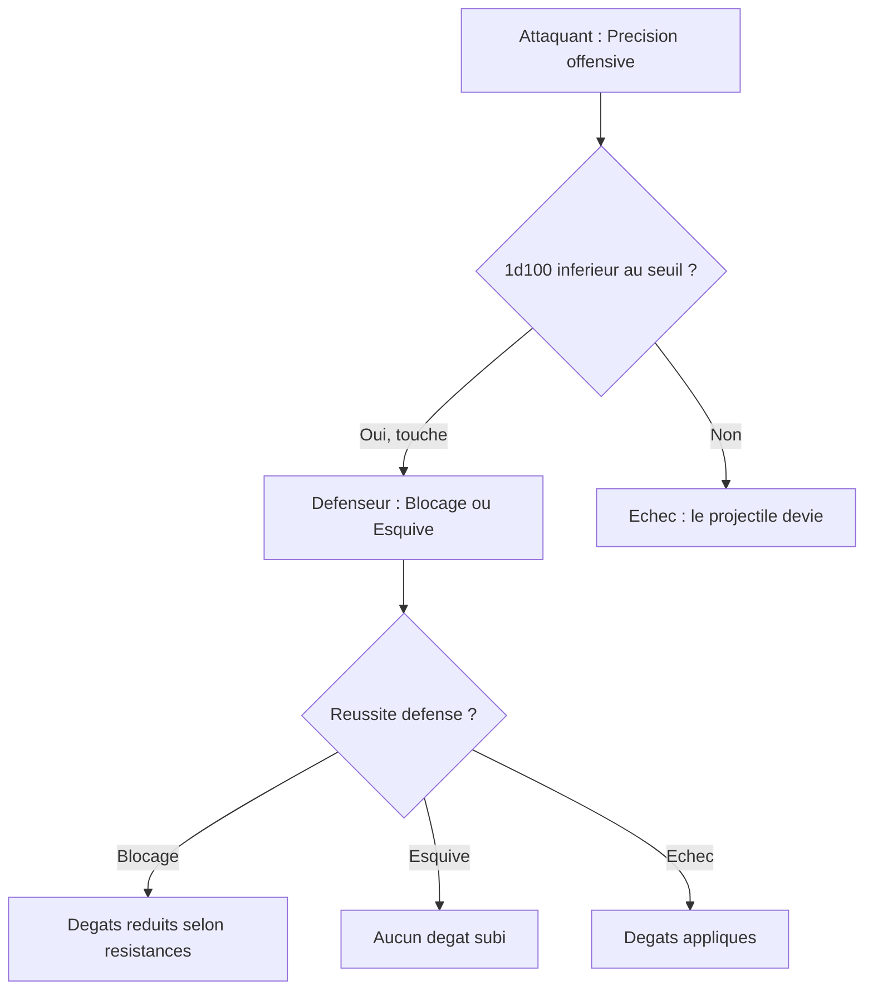

# III. Système de combat

## A. Lancement du combat

Deux situations peuvent survenir au lancement d'un combat : une **attaque surprise** ou une **attaque de front**. Ces deux situations ne sont pas équivalentes.

### Attaque surprise
Si la cible est **ignorante** de la présence de la créature, *c'est une attaque surprise qui permet à celle-ci de jouer en premier et d'avoir un bonus de précision à 95 % minimum au Corps à Corps et 50 % pour les sortilèges et attaques à distance.*

- D'autres bonus peuvent s'appliquer selon le style martial ou de magie de la créature attaquante.

### Attaque de front
Si la cible a **connaissance** de la présence de la créature, *c'est une attaque de front qui fait jouer les créatures adverses en premier.*

### Attaque en groupe
Lorsque la créature visée est en groupe, une détection par l'une et la communication de l'information (aggro) **permet aux autres de ne pas être surprises**.

- Les bonus d'attaque surprise s'appliquent uniquement aux **deux premières** créatures attaquant.
- Pour déterminer l'ordre de jeu, les créatures lancent `1d100 ± DEXT` ; l'ordre se fait par ordre **croissant** des résultats.

## B. Actions

### Généralité
Toutes les actions qu'une créature effectue prennent l'ensemble du tour (environ 10 secondes).

- Le déplacement à pied est normalisé pour tout le monde : **10 mètres** (20 m en vol, 5 m de nage pour les non-aquatiques) et ne permet pas d'effectuer une autre action sans bonus explicite.
- L'ensemble des actions offensives, défensives ou neutres prennent tout le tour, sauf lors du déclenchement d'une **attaque d'opportunité** ou d'une **réaction défensive** (liée à un sort à la place du blocage magique).

Quelques exemples d'actions : une attaque au corps à corps, à distance ou le lancement d'un sortilège ; se préparer à sprinter ; lancer un objet ; s'équiper de son arme ; s'accroupir ; aider une autre créature ; consommer un objet ; se mettre en état de posture ou d'incantation.

### Actions offensives simples — Corps à corps / Attaque à distance

Lors d'une attaque d'une créature sur une autre, la réussite se détermine ainsi :

1. La créature attaquante effectue un jet de **précision offensive** : `1d100 < SEUIL_FICHE`.
2. *Si la valeur du dé est inférieure au seuil*, la créature visée doit effectuer au choix un jet de **blocage** ou d'**esquive** (sinon l'attaque a échoué, le projectile frappe un autre emplacement).
3. Pour esquiver ou bloquer, la cible doit obtenir un score inférieur à celui de précision offensive.

**BLOCAGE** — la cible diminue les dégâts subis selon le % indiqué sur ses résistances.
- *Réussite remarquée :* la créature annule la moitié des dégâts subis avant l'application des résistances.
- *Réussite critique :* la créature annule tous les dégâts subis.

**ESQUIVE** — la cible annule totalement les dégâts subis.
- *Réussite remarquée / critique :* vous évitez également les effets de zone des attaques dirigées sur vous.

Si l'attaquant réussit son action offensive (même partiellement), il inflige le montant fixe de dégâts lié à son arme (modifié par sa pratique martiale ou magique), sauf en cas de réussite remarquée ou critique.

> RQ : les attaques à distance peuvent se voir imposer un malus par le MJ (pénombre, distance élevée, effet de statut…).

### Cas particulier de la magie

**Retour de flammes** — lorsqu'un mage utilise de la magie, il peut faire des erreurs (mal prononcer une formule, briser sa connexion au divin…). Cette grandeur inflige des dégâts correspondant au sort lancé.

> RETOUR_FLAMME = BASE_RETOUR - INCREMENT_CASTMAGE

Lors du lancement d'un sort, le mage doit lancer un dé déterminant s'il arrive à lancer son sort sans subir ces dégâts (pour tous les types de sorts).

**Dégâts infligés** — les dégâts sont en majorité fixes, mais dépendent de deux caractéristiques selon que la créature est martiale ou lanceuse de sortilèges.

> DMG_ARME = BASE_ARME + INCREMENT_FORCE

> DMG_SORT = BASE_SORT + PUISSANCE_DE_SORT

> RQ : les dégâts sont calculés **par attaque**. Si une créature lance plusieurs projectiles, le calcul est fait pour chaque projectile qui touche.

### Postures et Incantations

**Postures** — exclusivement liées aux archétypes martiaux et semi-martiaux ; c'est un **état de concentration** qui peut être brisé par des effets de déplacement, d'étourdissement ou de mise à terre.
- Activer une posture prend tout le tour et consomme immédiatement l'énergie nécessaire.
- Les postures ne sont pas cumulables : en activer une nouvelle écrase la précédente.
- Une posture classique dure au minimum 10 tours, sauf indication contraire.

**Incantations** — exclusivement liées aux lanceurs de sortilèges et semi-martiaux ; état de concentration brisé par déplacement, étourdissement, mise à terre, ou si vous vous déplacez pendant le tour.
- L'incantation ne doit pas être interrompue pour que le sort se lance correctement.
- Subir des attaques réussies augmente les chances de retour de flamme de **15 % par coup** subi pendant l'incantation.

### Coût énergétique
Vous ne dépensez de l'énergie que lorsque vous effectuez une **manœuvre** ou un **sortilège**, à l'exception du **blocage** qui consomme autant d'énergie que vous avez bloqué de dégâts (sauf en cas de critique).

## C. Actions & Effets spéciaux

### Effet de statut
Certaines réussites critiques ou d'habileté appliquent un **effet de statut** à l'impact (attaque à l'arme ou application d'un sort). Vous appliquez des effets élémentaires ou physiques comme [[Saignement]] ou encore [[Choc]] ; l'effet dépend de l'arme utilisée.

### Manœuvres
Les manœuvres sont des actions particulières liées à la progression martiale d'une arme ou d'un arbre général. Elles ont différentes caractéristiques : nom, description, effet, ressource d'action, temps de recharge, coût énergétique, et embranchement (« évolution de »).

| Caractéristique | Description |
|---|---|
| Nom de la manœuvre | Le nom affiché |
| Description | Ce que fait la manœuvre |
| Effet | L'effet mécanique appliqué |
| Ressource d'Action | Action, réaction, gratuite… |
| Temps de recharge | Nombre de tours |
| Coût énergétique | Énergie dépensée |
| Embranchement | « Évolution de » (prérequis) |
